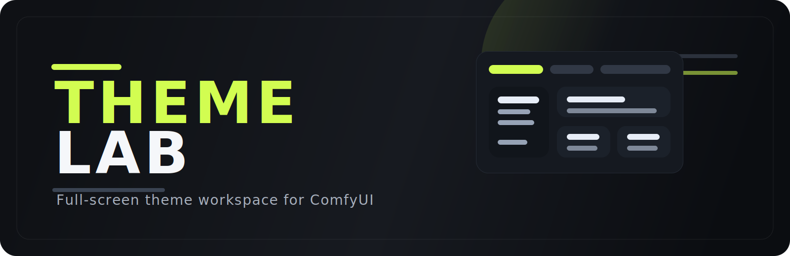

<p align="center">
  
</p>

<p align="center">
  Full-screen theme workspace for ComfyUI with a saved theme library, live editing, bundled presets, and extension styling discovery.
</p>

<p align="center">
  <strong>Template-style studio</strong> · <strong>Saved themes</strong> · <strong>Canvas tuning</strong> · <strong>Extension styling scan</strong>
</p>

## Overview

Theme Lab replaces the old sidebar-first workflow with a dedicated Studio window styled around the ComfyUI Templates experience. It gives you one place to browse saved themes, edit the active theme, apply it back into ComfyUI, and ship bundled presets with preview images.

## Highlights

- Full-screen Studio window with Template-style navigation and layout
- Saved theme browser with grid and list views
- Theme previews with local images or generated gradients
- Theme descriptions shown directly in Saved Themes
- Live theme editing for Comfy colors, LiteGraph colors, canvas geometry, typography, and advanced CSS
- Apply flow that writes the active theme to ComfyUI's `Theme Lab.json` theme file
- Extension styling discovery from loaded extension settings and scanned CSS variables
- Optional extension styling toggle for safer theme authoring when third-party UI is unstable
- Bundled theme library support through `themes/library.json` and `themes/previews/`

## What Theme Lab Edits

Theme Lab is built for theme authoring, not just color swapping. The editor can manage:

- Core ComfyUI theme colors
- LiteGraph canvas colors
- Canvas geometry such as outline widths, connection widths, reroute dot sizes, and slot spacing
- Typography and UI density presets
- Advanced CSS variables and raw CSS overrides
- Theme descriptions and preview images
- Themeable extension settings grouped under `Extension - Name`

## Installation

```bash
cd ComfyUI/custom_nodes
git clone https://github.com/criskb/MKRShift_Theme_Lab.git
```

Then:

1. Restart ComfyUI.
2. Hard refresh the browser after frontend updates.

## Using Theme Lab

1. Open `Theme Lab` from the sidebar icon.
2. Browse `Saved Themes` or open `Theme Editor`.
3. Edit colors, canvas settings, preview image, description, and extension styling.
4. Click `Apply` to overwrite the ComfyUI user theme file for Theme Lab and refresh the runtime theme.

## Storage And Bundled Assets

Theme Lab uses both user data and bundled extension assets:

- User library: `themelab.themes.json`
- User preview images: `themelab/previews/`
- Applied ComfyUI theme export: `themes/Theme Lab.json`
- Bundled preset library: `themes/library.json`
- Bundled preview images: `themes/previews/`

If a theme has no preview image, Theme Lab falls back to a generated gradient based on its palette colors.

## Extension Styling Scan

Theme Lab does not blindly patch every extension. It surfaces themeable controls from:

- Loaded frontend extension settings that look visual or styling-related
- Scanned CSS variables declared inside installed custom node frontend files

Discovered controls are grouped into a single editor card per extension under `Extension - Name`.

Some extensions may still need a reload after styling changes if they cache their UI state aggressively.

## Project Layout

```text
MKRShift_Theme_Lab/
├── __init__.py
├── assets/
│   └── theme-lab-readme-banner.svg
├── backend/
│   └── extension_style_scan.py
├── js/
│   ├── theme-lab.js
│   ├── theme-lab.css
│   ├── theme-lab-canvas.js
│   ├── providers/
│   │   ├── extension-settings-provider.js
│   │   └── extension-style-provider.js
│   └── studio/
│       └── template-studio.js
├── themes/
│   ├── library.json
│   └── previews/
└── README.md
```

## Development Notes

- Main extension entry: [`js/theme-lab.js`](./js/theme-lab.js)
- Studio UI: [`js/studio/template-studio.js`](./js/studio/template-studio.js)
- Canvas tuning layer: [`js/theme-lab-canvas.js`](./js/theme-lab-canvas.js)
- Extension settings discovery: [`js/providers/extension-settings-provider.js`](./js/providers/extension-settings-provider.js)
- Extension CSS variable scan: [`backend/extension_style_scan.py`](./backend/extension_style_scan.py)

## License

See [`LICENSE`](./LICENSE).
