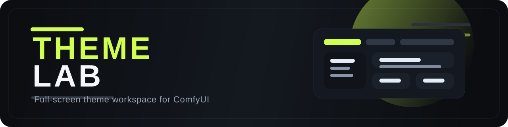

<p align="center">
  
</p>

<p align="center">
  Full-screen theme workspace for ComfyUI with saved themes, live editing, bundled presets, and extension styling discovery.
</p>

<p align="center">
  <strong>Template-style studio</strong> · <strong>Saved theme library</strong> · <strong>Canvas tuning</strong> · <strong>Extension styling scan</strong>
</p>

## Features

- Full-screen Studio window styled around the ComfyUI Templates experience
- Saved theme browser with grid and list layouts
- Theme descriptions and preview images shown directly in Saved Themes
- Live editing for ComfyUI colors, LiteGraph colors, canvas geometry, typography, and advanced CSS
- Node mode presets for default, soft card, media card, glass panels, liquid glass, floating tabs, mono slab, and minimal node chrome
- Built-in node base shape controls and quick shape presets for box, round, and card silhouettes
- Apply flow that writes the active theme back into ComfyUI as `themes/Theme Lab.json`
- Bundled preset support through `themes/library.json` and `themes/previews/`
- Extension styling discovery from loaded frontend settings and scanned CSS variables
- Optional extension-styling safety toggle for unstable third-party UIs

## Compatibility

- Package metadata declares `requires-comfyui = ">=0.16.0"`
- Theme Lab is a frontend-only `WEB_DIRECTORY` extension with a small backend route used for extension CSS-variable discovery
- The project currently targets the documented ComfyUI frontend extension APIs for settings, commands, dialogs, bottom-panel tabs, and sidebar tabs
- I verified the current official ComfyUI custom-node packaging and frontend-extension docs on March 28, 2026 before this refresh

## Installation

### ComfyUI Manager

1. Open ComfyUI Manager.
2. Search for `Theme Lab`.
3. Install the extension and restart ComfyUI.

### Manual Install

```bash
cd ComfyUI/custom_nodes
git clone https://github.com/criskb/MKRShift_Theme_Lab.git
```

Then:

1. Restart ComfyUI.
2. Hard refresh the browser after frontend updates.

## Quick Start

1. Open `Theme Lab` from the sidebar icon.
2. Browse `Saved Themes` or switch to `Theme Editor`.
3. Edit colors, canvas geometry, typography, descriptions, preview images, and extension styling.
4. Click `Apply` to export the active palette into ComfyUI's theme folder.
5. If a third-party extension does not redraw cleanly, use Theme Lab's reload action.

Theme Lab does not add workflow nodes. It is a workspace-style extension that runs directly in the ComfyUI frontend.

## Configuration

Theme Lab exposes settings under ComfyUI's extension settings, including:

- live preview behavior
- bottom panel quick access
- floating sidebar-card rendering
- reset confirmation safety
- provider manifest URLs

Inside the editor you can also control whether extension styling should be saved with the active theme.

## What Theme Lab Edits

Theme Lab goes beyond simple palette swapping. The editor can manage:

- core ComfyUI theme colors
- LiteGraph canvas colors
- canvas geometry such as outline widths, connection widths, reroute dot sizes, and slot spacing
- typography and UI density presets
- node mode presets layered on top of the default ComfyUI node renderer
- advanced CSS variables and raw CSS overrides
- theme descriptions and preview images
- themeable extension settings grouped under `Extension - Name`

## Storage And Bundled Assets

Theme Lab uses both user data and bundled extension assets:

- User library: `themelab.themes.json`
- User preview images: `themelab/previews/`
- Applied ComfyUI theme export: `themes/Theme Lab.json`
- Bundled preset library: `themes/library.json`
- Bundled preview images: `themes/previews/`

If a theme has no preview image, Theme Lab falls back to a generated gradient based on its palette colors.

## Extension Styling Scan

Theme Lab does not blindly patch every extension. It surfaces themeable controls from:

- loaded frontend extension settings that look visual or styling-related
- scanned CSS variables declared inside installed custom node frontend files

Discovered controls are grouped into a single editor card per extension under `Extension - Name`.

Some extensions cache their UI aggressively. If styling changes appear to save but do not visibly apply, reload the canvas or browser once after applying.

## Documentation

- Studio notes: [`js/docs/theme-lab-studio.md`](./js/docs/theme-lab-studio.md)
- Bundled theme asset notes: [`themes/README.md`](./themes/README.md)

## Development

Main files:

- Extension entry: [`js/theme-lab.js`](./js/theme-lab.js)
- Studio UI: [`js/studio/template-studio.js`](./js/studio/template-studio.js)
- Canvas tuning layer: [`js/theme-lab-canvas.js`](./js/theme-lab-canvas.js)
- Extension settings discovery: [`js/providers/extension-settings-provider.js`](./js/providers/extension-settings-provider.js)
- Extension CSS variable scan: [`backend/extension_style_scan.py`](./backend/extension_style_scan.py)

Local validation:

```bash
node --check js/theme-lab.js
node --check js/theme-lab-canvas.js
node --check js/providers/extension-settings-provider.js
node --check js/providers/extension-style-provider.js
node --check js/studio/template-studio.js
python3 -m py_compile __init__.py backend/__init__.py backend/extension_style_scan.py
```

GitHub Actions runs the same syntax validation in [`.github/workflows/validate.yml`](./.github/workflows/validate.yml).

## Troubleshooting

### Theme applied but some UI did not visibly refresh

- Apply the theme again once.
- Reload the canvas or browser if a third-party extension caches its UI.
- Check that the active export exists at `themes/Theme Lab.json`.

### Extension styling controls are missing

- Theme Lab only surfaces controls that are discoverable from loaded extension settings or scanned CSS variables.
- Restart ComfyUI after installing or updating other custom nodes.

### Saved themes look correct but previews are missing

- Ensure the preview image exists in `themelab/previews/` for user themes or `themes/previews/` for bundled themes.
- If no image is present, Theme Lab intentionally falls back to a generated gradient cover.

## Project Layout

```text
MKRShift_Theme_Lab/
├── .github/
│   └── workflows/
│       └── validate.yml
├── __init__.py
├── assets/
│   ├── banner.svg
│   ├── icon.svg
│   └── theme-lab-readme-banner.svg
├── backend/
│   ├── __init__.py
│   └── extension_style_scan.py
├── js/
│   ├── docs/
│   │   └── theme-lab-studio.md
│   ├── providers/
│   │   ├── extension-settings-provider.js
│   │   └── extension-style-provider.js
│   ├── studio/
│   │   └── template-studio.js
│   ├── theme-lab-canvas.js
│   ├── theme-lab.css
│   └── theme-lab.js
├── pyproject.toml
├── themes/
│   ├── README.md
│   └── library.json
└── README.md
```

## License

See [`LICENSE`](./LICENSE).

This extension/addon was created using Codex skill designed by Cris K B https://github.com/criskb/comfyui-node-extension-builder
